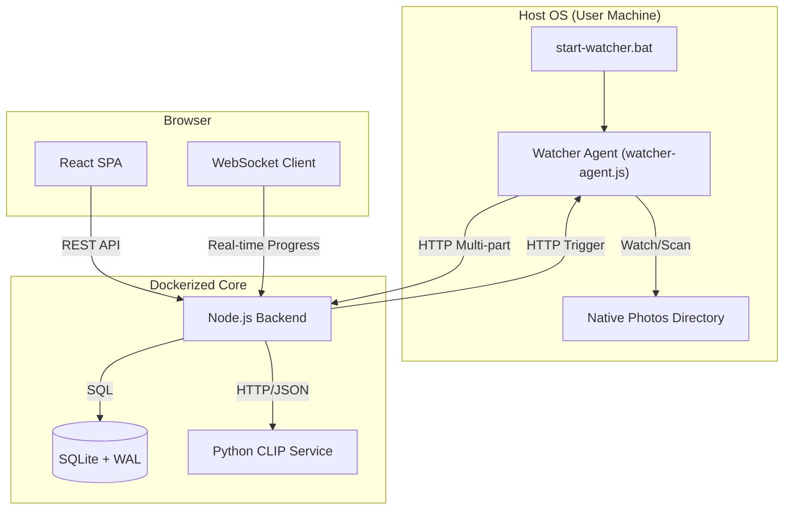

# Fotowise: Ultimate Technical Architecture Report

## 1. Executive Summary & Tech Stack
Fotowise is a **local-first, privacy-engineered** media management suite. It is designed to replace cloud-based photo services with a high-performance, AI-capable alternative that runs entirely on the user's hardware.

### Core Philosophy
*   **Privacy by Design**: No cloud ingestion. All AI models (CLIP, Face-ID, OCR) run on local silicon.
*   **Performance**: Hybrid search utilizing SQL for metadata and Vector Similarity for semantic discovery.
*   **Reliability**: "Bridge" architecture to allow containerized apps to interact with native Windows/host filesystems.

### Tech Stack
*   **Frontend**: React 18, Vite, TypeScript, Tailwind CSS, Framer Motion, Zustand (State), TanStack Query (Data).
*   **Backend (Core)**: Node.js 20, Express, TypeScript, Sharp (Image Processing), Fluent-FFmpeg (Video).
*   **Database**: SQLite via `better-sqlite3` (WAL mode enabled).
*   **AI Service**: Python 3.10, FastAPI, PyTorch, Transformers (CLIP ViT-B/32), Pillow.
*   **Host Agent**: Node.js, Chokidar (FS Watching), Form-Data.
*   **Infrastructure**: Docker, Docker Compose.

---

## 2. System Architecture
The application is split into three primary domains: the Browser Client, the Dockerized Core, and the Host Agent.

---

## 3. The Host-Container Bridge
Standard Docker containers cannot browse the host's native Windows drives (e.g., `D:\Pictures`) without complex mount configurations. Fotowise solves this via the **Watcher Agent**:

1.  **Native Access**: `watcher-agent.js` runs as a native Node.js process on the Host OS. It has full permissions to use `chokidar` to monitor any folder.
2.  **Directory Proxying**: The UI calls `/api/watcher/directories`, which the Backend proxies to the Agent's `/list-directories` endpoint. This allows the user to browse their "Real PC" inside the web browser.
3.  **The Ingestion Flow**:
    - Agent detects a file -> Reads stream from disk -> Sends `POST` to `/api/media/upload`.
    - Alternatively, Agent scans a folder -> Reports progress -> Backend broadcasts to UI.
4.  **Bypassing Sandboxing**: Since the Agent is "outside" Docker and the Browser, it acts as a trusted pipe that pushes data into the sandbox.

---

## 4. Frontend Architecture & UI Failsafes
The frontend is a React Single Page Application (SPA) designed for "Zero-Flicker" navigation.

### Component Structure
*   **AppShell**: Persistent sidebar and job tracker.
*   **Onboarding Flow**: A 4-step wizard that establishes the Agent connection and initial library indexing.
*   **FolderPicker**: A specialized component that renders the "Host Filesystem" view by querying the Agent bridge.

### UI Failsafes & Resilience
*   **Indeterminate Progress**: If the Backend hasn't sent a real progress percentage yet, the UI uses a `visualProgress` crawl that slowly moves to 90% to provide feedback (Logic in `OnboardingModal.tsx`).
*   **UI Lock-in Prevention**: The "Force Skip" escape hatch appears after 5 seconds of processing, ensuring users are never trapped in a "hanging" onboarding screen if the AI service lags.
*   **Graceful Chunk Loading**: React `Suspense` fallbacks are CSS-matched to the page background to hide lazy-loading flickers.

---

## 5. Real-Time Event System (WebSockets)
Fotowise uses a dedicated WebSocket channel (`/ws/progress`) to ensure the UI stays in sync with background AI jobs.

### Event Lifecycle
1.  **`job_started`**: Backend creates a job ID (e.g., `scan` or `ai_index`) and broadcasts to all clients.
2.  **`job_progress`**: Agent or Backend sends periodic updates (e.g., "50 of 1000 files processed").
3.  **`job_completed` / `job_failed`**: Final state synchronization.

### Guarantees
- **Unified State**: The `useJobStore` (Zustand) aggregates these events into a global `jobs` record.
- **Auto-Reconnect**: The `useWebSocket` hook implements a 5-second exponential backoff for connection drops.

---

## 6. AI & Search Pipeline
The AI pipeline is **multi-stage and asynchronous** to maintain application responsiveness.

### Image Ingestion Pipeline
1.  **Metadata (Sync)**: EXIF extraction (GPS, Camera settings), Blur detection (Laplacian Variance), and basic DB insertion.
2.  **Vectorization (Async)**: Image is sent to Python CLIP Service. Returns a 512-dim embedding.
3.  **Zero-Shot Tagging (Async)**: CLIP compares the image against a preset vocabulary to generate "Smart Tags" (e.g., 'Sunset', 'Beach').
4.  **Face/Doc (Async)**: Concurrent jobs for face clustering and OCR (if identified as a document).

### Search Mechanism
*   **Keyword**: SQL `LIKE` queries against filenames and smart tags.
*   **Semantic**: Natural language string -> CLIP Text Vector -> Cosine Similarity comparison against all `media_embeddings` blobs in the DB.

---

## 7. API Contract
| Context | Endpoint | Method | Payload | Behavior |
| :--- | :--- | :--- | :--- | :--- |
| **Backend** | `/api/media/upload` | `POST` | `multipart/form-data` | Ingests file and triggers AI pipeline. |
| **Backend** | `/api/search` | `GET` | `?q=query&limit=60` | Performs hybrid search. |
| **Backend** | `/api/watcher/start` | `POST` | `{ folderPath }` | Configures Agent and triggers scan. |
| **Agent** | `/list-directories` | `GET` | `?path=C:\` | Returns native host directory listing. |
| **Agent** | `/trigger-scan` | `POST` | `{ folderPath }` | Initiates recursive disk walk. |

---

## 8. Database Schema
Fotowise utilizes a relational schema to link metadata with high-dimensional AI data.

*   **`media`**: Root metadata. UUID primary key.
*   **`media_embeddings`**: FK to `media.id`. Stores normalized vector BLOBs.
*   **`face_detections`**: FK to `media.id`. Stores bounding boxes and facial embeddings.
*   **`face_clusters`**: Groups `face_detections` by similarity (Offline Person Tagging).
*   **`tags` / `media_tags`**: Many-to-Many junction for Smart Tags.
*   **`jobs`**: Persists background task status (Scan, Indexing, Cleanup).

---

## 9. Deployment & Environment
### Environment Variables
- `PORT`: Backend port (default 3000).
- `LIBRARY_PATH`: Root folder for originals and thumbnails.
- `DB_PATH`: Location of `fotowise.db`.
- `CLIP_SERVICE_URL`: URL of the Python AI container.

### Cold-Start Procedure
1.  **Containers**: Run `docker-compose up -d`. This starts the Core Backend and the CLIP AI service.
2.  **Host Agent**: Run `node watcher-agent.js` (or use `start-watcher.bat`).
3.  **Onboarding**: Navigate to `localhost:3000`. The App will auto-detect the Agent and prompt for the initial folder selection.
4.  **AI Indexing**: Once the folder is selected, the "Bridge" will push files to the Backend, and the AI Pipeline will begin vectorization.
